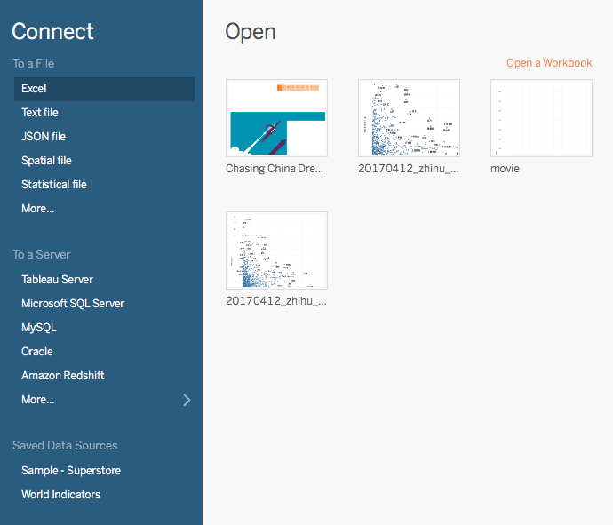
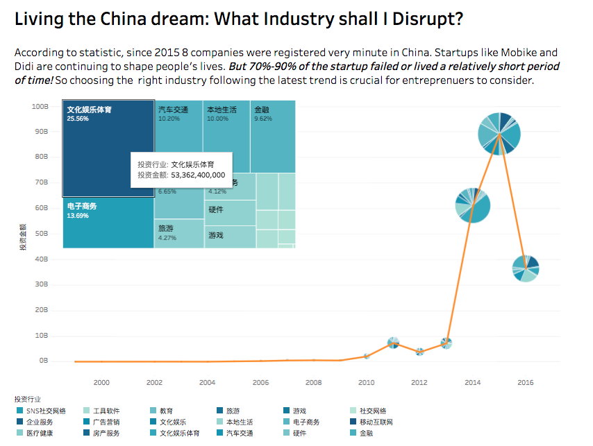
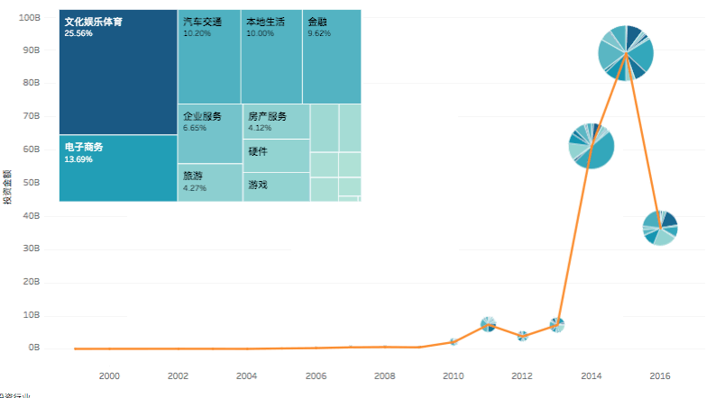
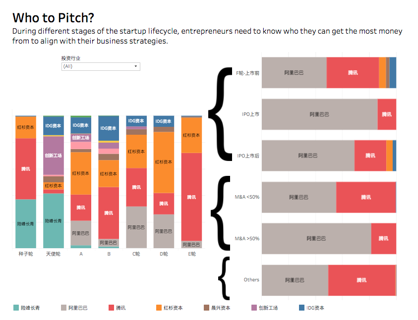
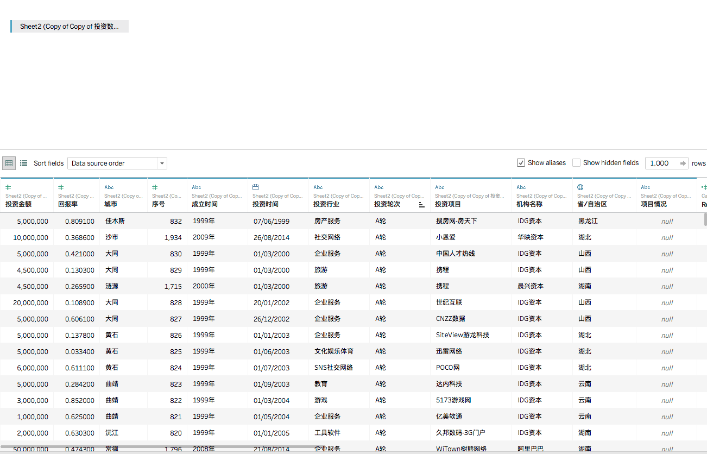
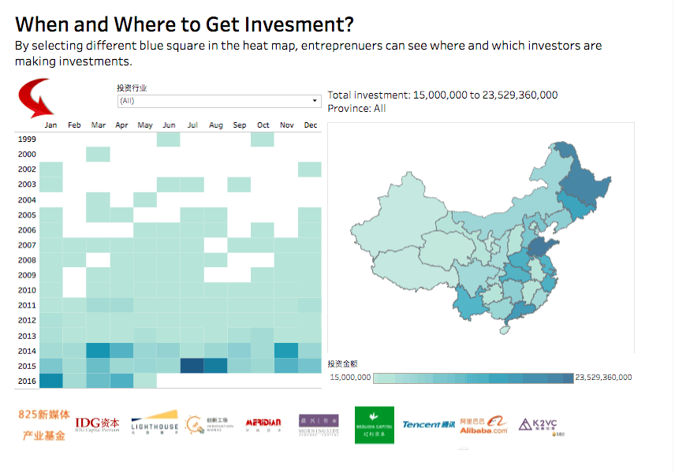
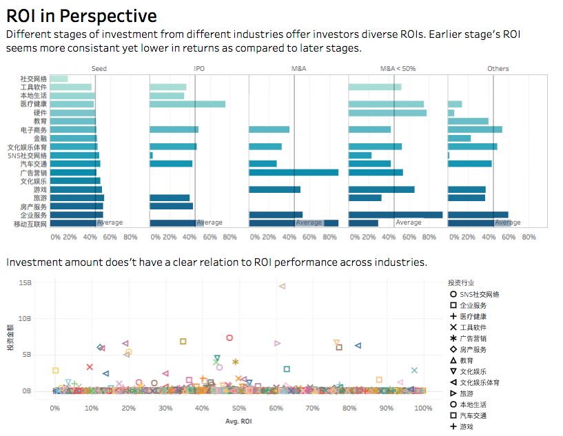
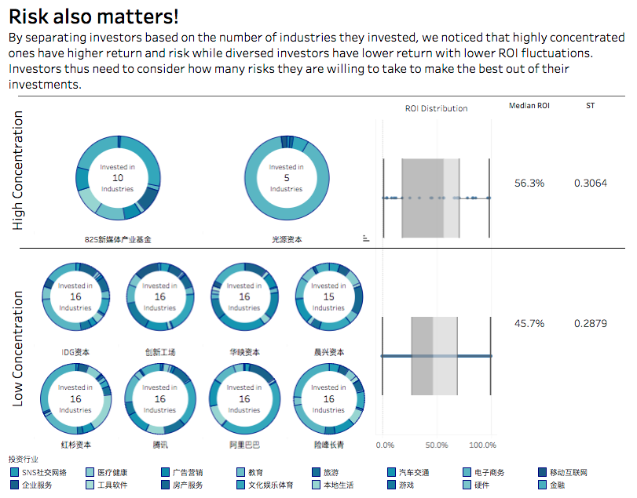

```{r global_options, include=FALSE}
knitr::opts_chunk$set(echo=TRUE, warning=FALSE, message=FALSE, fig.path = "pic/")
```

```{r echo=FALSE}
library(readxl) # 读取 excel
library(dplyr) # 数据处理
library(ggplot2) # 作图
library(treemapify) # 面积图
library(ggthemes) # 修改图表样式
library(scales) # 单位显示处理
theme_set(theme_minimal(base_family = 'PingFang SC Light')) # 设置主题和字体
```

作为一名优秀的数据分析师，或多或少都需要了解行业对于自身职业的要求。如果你曾留意一些数据分析的职位要求，你可能看到过这个名词：**Tableau**。比如今日头条的[这条招聘信息](https://www.lagou.com/jobs/3245148.html)：

> 熟悉常用的数据统计和分析方法，熟练使用SQL，Excel，会使用 **Tableau** 的优先； 

Tableau 由于它界面美观、易于操作，受到越来越多特别是互联网公司的亲睐，无论是大到 Facebook、Airbnb 这样的巨型公司，还是像国内 Teambition 这样的创业团队，都能看到 Tableau 的身影。如果你在知乎上关注了 Facebook 邹昕大神的话，你也一定看过他关于“[知乎大 V 是如何成为大 V 的？](https://www.zhihu.com/question/24489617/answer/157013281)”的回答（什么，你竟然还没有读过？还不快去点赞！），整个分析就是用 Tableau 完成的。

目前 Tableau 2017 年的可视化大赛正在进行中，上海站的比赛刚刚结束（我们曾邀请去年的上海站冠军纪杨老师[来优达做分享](http://www.bilibili.com/video/av10587878/))，这次我们就以今年冠军的作品“Chasing China Dream（圆梦中国）”为案例，展示 Tableau 在可视化方面的过人之处。

### 对比基础

在这篇文章中，我们用 R(ggplot2) 来和 Tableau 作对比，看看谁可以 **方便又快速** 地作出美观的图表。得益于ggplot2 的grammar of graphics理念，R 相对于 Python 在作图方面更加流畅，也基于此，优达和 Facebook 一起开发的探索性数据分析课程（Exploratory Data Analysis）使用R作为工具。那么这次 R 和 Tableau 的对决又会有怎样的表现呢？

这次我们将使用 R 的 ggplot2 来模仿 [本次上海站冠军 Young Lin 的作品](https://public.tableau.com/profile/young.lin#!/vizhome/ChasingChinaDream/Story1)。在作图的过程中，我们尽可能使用自带的功能和最基本的库来对比 Tableau 自带的功能。虽然 R 可以通过小众的插件或是写非常复杂的代码来最大化近似 Tableau 的作图，但这有违我们评比的初衷，毕竟对于大部分分析师来说，更多的精力应该放在分析本身，可视化重要但不应该占用绝大部分的时间。

### 第一步：数据导入

本次可视化大赛数据格式为 excel，在 R 中我们借用 `readxl` 导入 excel 文件还算方便，但由于文件中大量字段是中文，如果你的系统环境是英文的话，很有可能会出现乱码的情况，这给数据的导入带来一些麻烦。如果你的R也遇到出现乱码的情况，可以在 R Console 中输入 `Sys.setlocale("LC_ALL", 'en_US.UTF-8')` 进行编码重置，并点击 File -> Reopen With Encoding。

相对来说，Tableau 的数据导入顺利的多。



Tableau 自身支持的文件格式有很多，包括：Excel、Text file (csv, tsv)、JSON 等等，也包括各种 Server。最重要的是，Tableau 对中文的支持非常不错，可以免去数据分析师很多不必要的麻烦。（特别是写 Python 的同学，一定懂我在说什么吧！）


```{r echo = FALSE}
pf <- read_excel('Tableau 可视化分析争霸赛上海站 - 数据.xlsx')
# str(pf)
# summary(pf)
```

### 模仿1：模仿投资额与产业的关系图

#### 原图解读




这是 Young Lin 的第1张图表，展现的是投资行业与投资金额的关系。这张图表分为两部分，首先是左上角的 Treemap，不同的方块代表不同的投资行业，方块的大小代表投资金额的多少。右下角是投资金额和时间的折线图，与普通折线图不同的是，在每一个折线的点上，都有一个饼图呈现不同行业的投资金额比例。当鼠标移动到对应的数据点时（无论是左上角的 Treemap 还是右下角的饼图或折线图），都会有对应数据的动态交互显现。

值得一提的是，该图中不同行业的颜色选择了渐进色，这点我觉得并不妥当。渐进色常用来表示有层级关系的分类（比如 1~10 的打分，比赛的名次），对于不同的行业名称本身并不存在这样的层级关系。但为方便对比，在用 R 作图时仍采用该渐进色。

#### 图表复现

接下去我们来用 R 复现。由于 ggplot2 原生不支持 treemap，因此在这里使用第三方工具 `treemapify` 来绘制。(刚开始就要借助第三方工具，哭。。。)

```{r treemap}
pf.industry <- pf %>% 
  group_by(投资行业) %>% 
  summarise(total.invest = sum(投资金额))

ggplot(pf.industry, aes(area = total.invest, fill = total.invest, label = 投资行业)) +
  geom_treemap() 

```

`treemapify` 作 treemap 图非常方便，两行代码就可以搞定，但是默认的视图配色非常难看，且颜色越深反而代表投资金额越少，与直觉不符。因此，在该图的基础上继续调整。

```{r treemap update}
ggplot(pf.industry, aes(area = total.invest, fill = total.invest / 10^9, label = 投资行业)) +
  geom_treemap()  + 
  scale_fill_continuous(low = '#c3e8df', high = '#467a9c',
                           labels = unit_format(unit = "B"),
                        guide = guide_legend(title = "投资额")) #重新设置标签
```

调整之后，颜色和图例好看了一些，但总觉得没有 Tableau 的配色好看（配色对直男来说真是说不出的痛）。另外，`treemap` 似乎也没有非常方便地在方块中呈现文字的方式。

接着再来看折线图。在 R 中很难方便地作出折线图和饼图的结合（在此再次感叹一下 Tableau 丰富的可视化表现形式，看上去就觉得很高级），因此退而求其次来画堆积柱状图。


```{r bar.year.industry}
pf.industry.year <- pf %>% 
  mutate(invest.year = strftime(投资时间, "%Y")) %>%  # 将投资时间拆分出来
  group_by(投资行业, invest.year) %>% 
  summarise(total.invest = sum(投资金额))

ggplot(pf.industry.year, aes(x = invest.year, y = total.invest / 10^9, fill = 投资行业)) +
  geom_bar(stat = 'identity', color = "grey") + 
  scale_y_continuous(labels = unit_format(unit = "B")) +
  labs(x = "", y = "投资金额") +
  scale_fill_grey()
```

我们可以看到，堆积柱状图基本展示了 Tableau 折线+饼图所呈现的信息，柱状图的高度代表每年的总投资额，色块的长度代表每个分类的投资额。但由于分类过多，将柱状图的颜色和图例的文字联系起来有点困难。而在这个方面，Tableau 的优势更加体现出来，将鼠标移至对应的图形上就可以弹出对应的行业分类和金额，非常方便 。



（上图为动图）

### 模仿2：投资轮次、投资机构和金额的关系图

#### 原图解读



这张图所展示的是在不同的投资轮次中，不同投资机构的投资占比。左右两边呈现的形式类似，左边是种子轮到E轮的数据，右边是F轮到 M&A 的数据（也包含 Others）。左上角还有一个下拉框筛选不同的投资行业，柱状图会根据不同的筛选而变化。

#### 图表复现


在原始的 excel 表格中，投资轮次并没有被分组整合，因此在作图之前我们需要基于以下关系做数据清洗。

- 种子轮：种子轮
- 天使轮：天使轮
- A轮：'A+轮', 'A轮', 'Pre-A轮'
- B轮：'B+轮', 'B轮'
- C轮：C轮
- D轮：D轮
- E轮：E轮

在 R 中，我们使用的方式是嵌套 `ifelse` 判断。

而在 Tableau 中，数据重命名优势马上可以体现出来，简单的拖拽即可实现，再多的分组都可以轻松搞定。


（上图为动图）

以下是 R 实现的代码，行数略微有些多。

```{r bar.round.investor}
pf.round.investor <- pf %>% 
  mutate(投资轮次.组合 = ifelse(is.element(投资轮次, c('A+轮', 'A轮', 'Pre-A轮')), 'A轮',
                         ifelse(is.element(投资轮次, c('B+轮', 'B轮')), 'B轮',
                         ifelse(投资轮次 == 'C轮', 'C轮', 
                         ifelse(投资轮次 == 'D轮', 'D轮', 
                         ifelse(投资轮次 == '种子轮', '种子轮',
                         ifelse(投资轮次 == 'E轮', 'E轮',
                         ifelse(投资轮次 == '天使轮', '天使轮', 'other')))))))) %>% 
  group_by(投资轮次.组合, 机构名称) %>% 
  summarise(金额 = sum(投资金额)) %>% 
  group_by(百分比 = 金额 / sum(金额))

pf.round.investor$投资轮次.组合 <- factor(pf.round.investor$投资轮次.组合,
                c('种子轮', '天使轮', 'A轮', 'B轮', 'C轮', 'D轮', 'E轮', 'other'))

ggplot(subset(pf.round.investor, 投资轮次.组合 != 'other'), 
       aes(x = 投资轮次.组合, y = 百分比, fill = 机构名称)) +
  geom_bar(stat = 'identity') +
  scale_fill_brewer(palette = 'Paired') +
  scale_y_continuous(labels = percent) +
  geom_text(aes(label = 机构名称, family = 'PingFang SC Light'), 
            position = position_stack(vjust = 0.5), check_overlap = TRUE, size = 3)

```


我们用 R 大体上还原了这张关系图，但在细节上还有一些不足。比如，Tableau 在柱状图上的文字可以根据背景颜色的深浅自动变换成黑字或者白字，来让读者看起来更清晰。另外，它也隐藏了一些拥挤色块上的文字，使图表显得更加整洁。这两点虽然是细节，但在 R 中处理起来比较费劲。另外一点，Tableau 里可以非常方便地设置下拉框来筛选展示的数据，这点在 R 中虽然可以做，但需要使用 Shiny 的功能，对大部分分析师来说会比较麻烦。

### 模仿3：时间、地点与投资额的关系图

#### 原图解读



这张图 Tableau 再下一程，在前图下拉框的基础上增加了左边热力图与右边地图的联动，从年、月、行业、省份、投资金额多个方面呈现。只需点击左侧任意方块，该方块投资金额对应的省份就会呈现在右边。


#### 图表复现

这张图左边的复现并不复杂，使用 `ggplot2` 自带的 `geom_tile` 即可完成热力图的绘制。

```{r heatmap.year.month}

pf.year.month <- pf %>% 
  select(投资时间, 投资金额) %>% 
  mutate(年 = strftime(投资时间, '%Y'),
         月 = strftime(投资时间, '%m')) %>% 
  group_by(年, 月) %>% 
  summarise(金额.总和 = sum(投资金额))


ggplot(pf.year.month, aes(x = 月, y = 年)) +
  geom_tile(aes(fill = 金额.总和 / 10^9)) +
  theme(text = element_text(family = 'PingFang SC Light'))+
  scale_fill_continuous(low = '#c3e8df', high = '#467a9c',
                           labels = unit_format(unit = "B"),
                        guide = guide_legend(title = "金额.总和")) 

```

这张图的难点是如何快速实现左侧热力图与右侧地图的联动。在 R 中只能通过 Shiny 来实现，相对于 Tableau 几步即可实现的联动功能，Shiny 要花的时间要多的多。

### 模仿4：不同行业的投资回报率的关系图

#### 原图解读



这张图中规中矩，下方的散点图由不同的图形代表不同的行业，绝大部分都集中在底部，显得比较杂乱，并没有特别多的信息可以解读。另外，由于分类较多，图形已有重复（比如圆形同时代表了SNS社交网络和本地生活），读者解读起来也非常困难。因此，对这幅图的复现主要针对于上方的横向柱状图。

#### 图表复现

这张图用 R 复现起来比较容易，首先依然是对数据的组合与清洗：

- Seed：A+轮，A轮，B+轮，B轮，C轮，D轮，E轮，Pre-A轮，天使轮，种子轮
- IPO：F轮-上市前, IPO上市, IPO上市后
- M&A：并购100%, 并购59%, 并购60%, 并购65%, 并购72%, 并购93%
- M&A < 50%：并购,并购15%, 并购35%, 并购37%
- Others：不明确, 战略投资

就像之前演示的，在这方面 Tableau 操作起来依然有很大的优势。

```{r bar.roi}
pf.roi <- pf %>% 
  mutate(投资轮次.组合 = 
        ifelse(is.element(投资轮次, c('并购100%', '并购59%', '并购60%', '并购65%', '并购72%', '并购93%')),
                              'M&A',
        ifelse(is.element(投资轮次, c('并购','并购15%', '并购35%', '并购37%')), 'M&A < 50%',
        ifelse(is.element(投资轮次, c('不明确', '战略投资')), 'Others',
        ifelse(is.element(投资轮次, c('F轮-上市前', 'IPO上市', 'IPO上市后')), 'IPO', 'Seed'))))) %>%
  group_by(投资轮次.组合, 投资行业) %>%
  summarise(平均ROI = mean(回报率),
            投资金额.汇总 = sum(投资金额)) #简单起见，直接取平均值

pf.roi$投资轮次.组合 <- factor(pf.roi$投资轮次.组合, c('Seed', 'IPO', 'M&A', 'M&A < 50%', 'Others'))

avg.roi <- mean(pf.roi$平均ROI)
  
ggplot(pf.roi, aes(x = 投资行业, y = 平均ROI)) +
  geom_bar(stat = 'identity') +
  scale_y_continuous(labels = percent) +
  facet_grid(.~投资轮次.组合) +
  geom_hline(yintercept = avg.roi, alpha = 0.3) +
  coord_flip()
  
```

作图方面，R 在这个图上并没有太大问题，纵向是不同的投资行业，横向是不同的投资阶段和ROI数值，浅色的直线代表平均的ROI。

### 模仿5：投资领域数量与投资回报的关系图

#### 原图解读



这张图特别是左侧的部分是所有图表中我最喜欢的一张，你可能也已经发现，在左侧的面积图中间空白处放置了说明标签，方便整洁地展现了不同投资机构投资的领域数量，有限的空间呈现了足够多的信息，但又不会觉得冗杂。

在 R 中虽然可以同样作出面积图，但中间内嵌标签却非常困难。在这一方面 Tableau 完胜！

### 总结

最后我们总结一下两者的优劣对比：

Tableau 的优势：

1. 操作简便，不需要写代码，简单地拖拽即可实现
2. 配色美观，图表样式多样，不用再头痛用什么颜色啦
3. 图表交互性好，特别是联动功能，可以最大程度地提升可视化的表现力

R 的优势：

1. 比较全能，分析的整个流程都可以做（当然也需要写代码）
2. 可以通过 notebook 记录整个分析的流程，方便内部存档和交流
3. 数据量大仍然有办法处理

通过对比，我们发现 Tableau 在可视化方面相对于 R 拥有很大的优势，特别适合互联网公司较快地工作节奏，可以在很短的时间内做出美观易用的图表。当然，R 虽然上手比 Tableau 更难一些，但它的能力更加全面，也能应对可视化之外的许多问题。

总之，如果你需要通过可视化将你的成果展现给老板或同事的话，Tableau 将会是你的第一选择。

Life is short. Use Tableau.